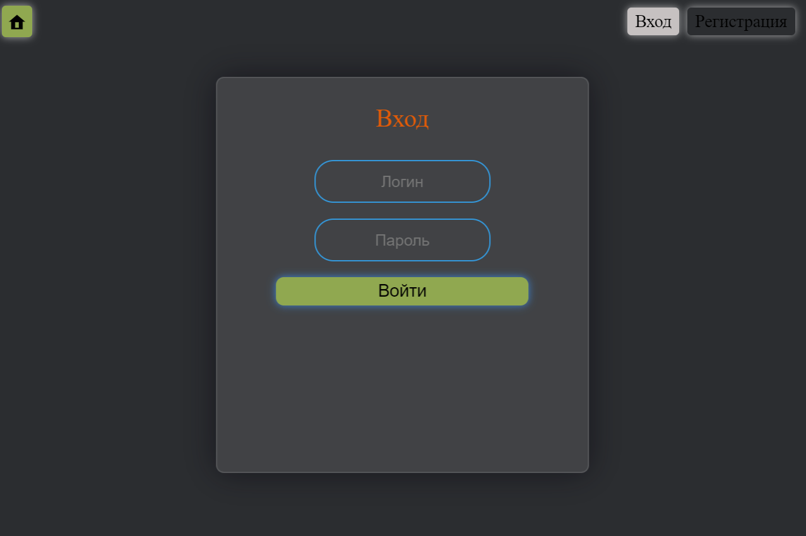
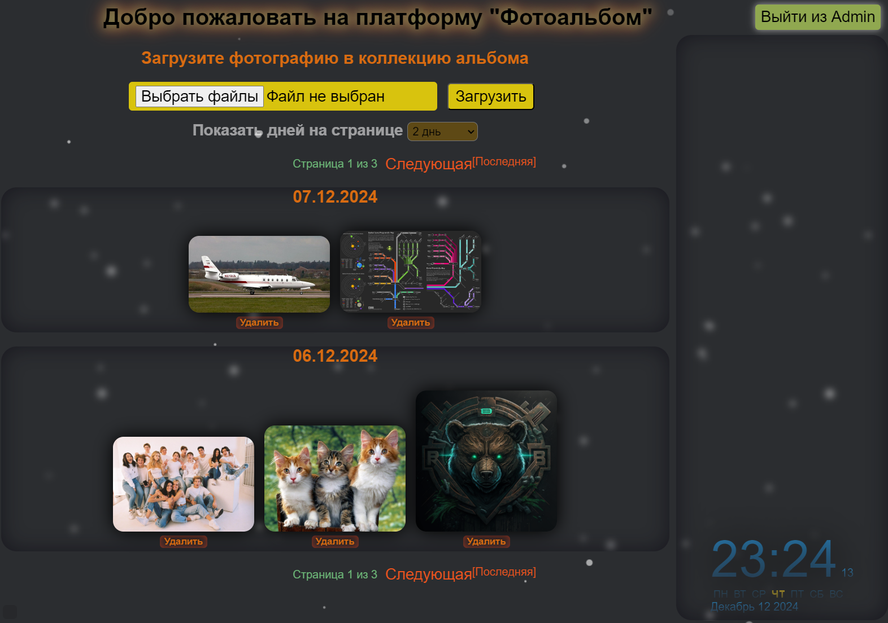

# Web-Photo-Album

### Проект: Веб-приложение, представляет собой фотоальбом с возможностями регистрации, авторизации пользователей, загрузки и удаления изображений и т.д.

## ️ Основные технологии
Список технологий и библиотек, использованных в проекте:
- **Backend**: Django
- **Frontend**: HTML, CSS, JavaScript
- **База данных**: SQLite

# 🛠️ **Установка и настройка**
1. **Установка**
   1. Скачать проект в PyCharm(е):
      * ИЛИ через терминал:
      * `git clone https://github.com/Volfram007/Web-Photo-Album`
   2. В PyCharm(е) создаём виртуальное окружение:
      * `python -m venv venv`
   3. Активируем виртуальное окружение:
      * `.\venv\Scripts\activate`
   4. Настраиваем interpreter
2. **Установить зависимости проекта:**
   * `pip install -r requirements.txt`
3. **Настройка БД:**
   * `python .\Django\manage.py migrate`
4. **Запуск проекта:**
   * Создание конфигурации запуска:
      * Конфигурация для "`Python`"
      * script == `manage.py`
      * "Script parameters" == `runserver`
      * "Working directory" == `$ProjectFileDir$/Django`
   * ИЛИ в консоли ввести:
      - `python .\Django\manage.py runserver`
   * Перейти по ссылке (обычно http://127.0.0.1:8000/)